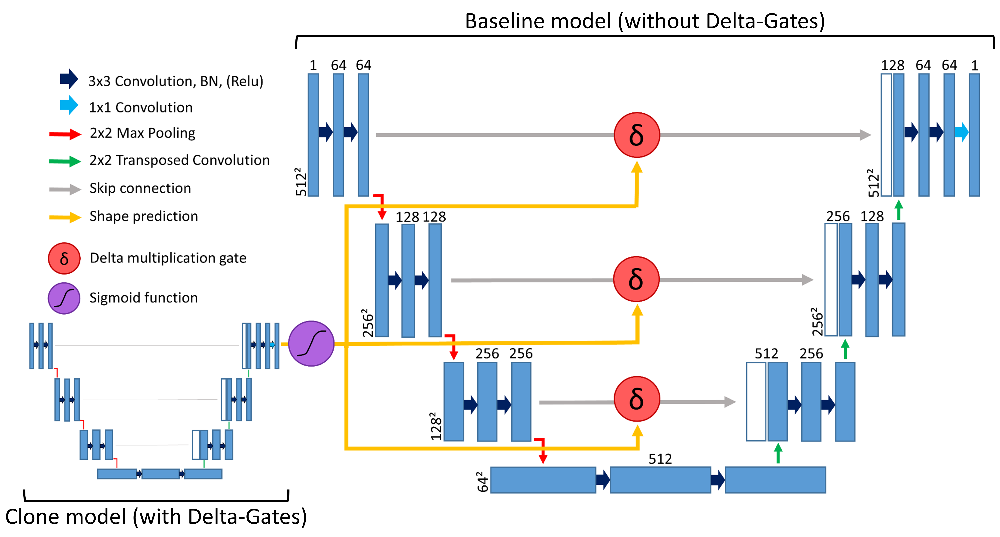

## Combining parallel trained U-Nets for Surface Model Generation with Sentinel-2 Imagery

This seminar paper investigates on the parallel training of multiple U-Nets at the 
same time. The application domain is around high resolution digital surface model (DSM) creation
from low resolution Sentinel-2 data. 

The workload, as previously explained, is split to one classification U-Net predicting the shape 
and one pixel-wise regression U-Net predicting the height of surface objects.

\
The full architecture is depicted in the following figure:

